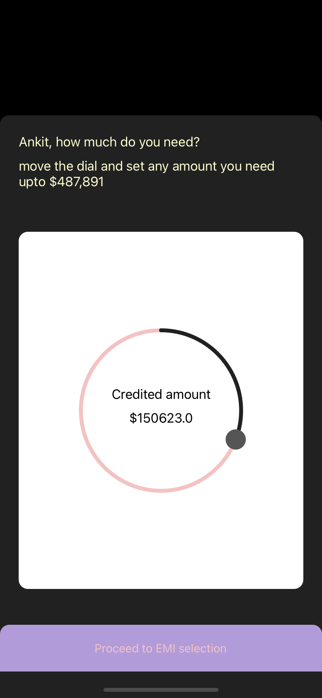
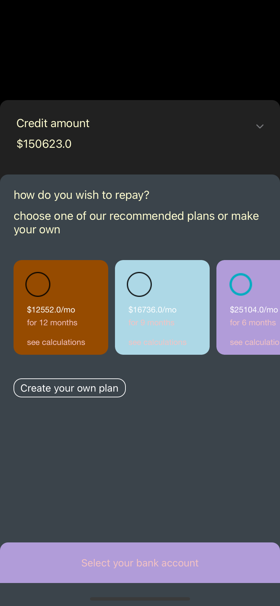
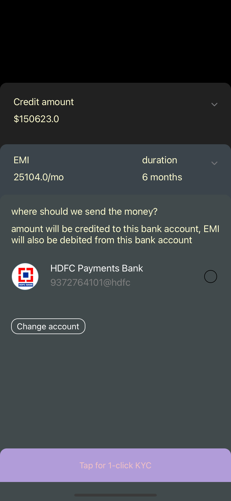

## Setting up the microapp 

- Run the following commands in terminal -
      
      rm -rf Pods
      rm -rf PodFile.lock
      pod install

  An .xcworkspace file will be created in the project directory. 

- Open the .xcworkspace file, build and run

## **App Screens**

